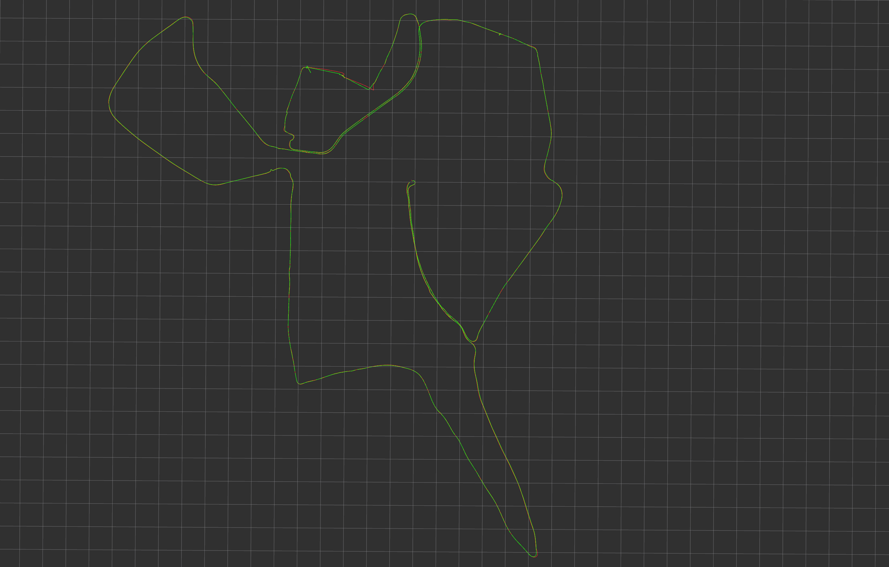

# ESKF

a fusion method of GPS and IMU based on error state kalman filter

## Prerequisites

1. ROS melodic

- package: nmea_navsat_driver

## IO and Datasets

### Input

1. required **GPS** messages, include:

  - position: longitude, latitude and altitude

2. required **IMU** messages, include:
  
  - angular velocity
  - linear acceleration
  
### Output

1. output the position and orientation in **NED** coordinate system, include:

  - position: north, east and down
  - orientation: w, x, y and z
  
### Datasets

- download from [utbm_robocar_dataset_20190131_noimage.bag](https://drive.utbm.fr/s/H4fH99RH8YwywY3)

## Build ESKF on ROS

```
cd ~/catkin_ws/src
git clone https://github.com/cquxyw/ESKF.git
cd ../
catkin_make
```

## Test on public dataset

1. run utbm_robocar_dataset_20190131_noimage.bag

```
rosbag play [dataset_dir]/utbm_robocar_dataset_20190131_noimage.bag
```

2. launch eskf package

```
source ~/catkin_ws/devel/setup.bash
roslaunch eskf eskf.launch
```

## Result in rviz
- the green path is made from raw GPS
- the red path is made from fused data by ESKF



## Reference

- paper: [Quaternion kinematics for the error-state Kalman filter](https://arxiv.org/abs/1711.02508)

- codes: [imu_x_fusion](https://github.com/cggos/imu_x_fusion.git) and [imu_gps_localization](https://github.com/ydsf16/imu_gps_localization.git)
